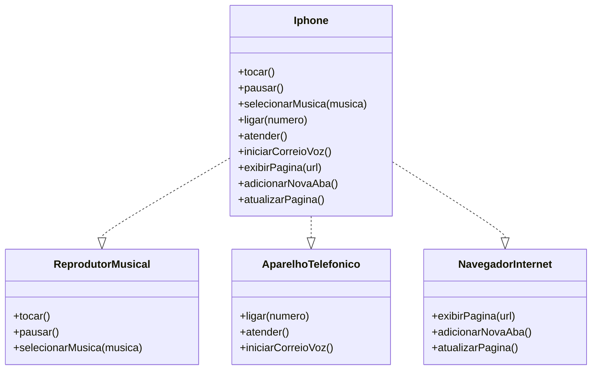

# iPhone - Desafio de Projeto POO - DIO

Este é um projeto proposto na **trilha de Java Básico** da [Digital Innovation One (DIO)](https://www.dio.me), com foco em aplicar os principais conceitos da **Programação Orientada a Objetos (POO)** em Java.

## Descrição do Desafio

O desafio consiste em modelar, diagramar e (opcionalmente) implementar um componente que represente um **iPhone**, simulando suas funcionalidades como:

- Reprodutor Musical
- Aparelho Telefônico
- Navegador na Internet

A proposta tem como inspiração o vídeo original de lançamento do iPhone em 2007, apresentado por Steve Jobs.

## Objetivo

- Criar um **diagrama UML** que represente as funcionalidades do iPhone de forma orientada a objetos.
- Implementar as **interfaces** e **classes** correspondentes no Java (opcional).

## Funcionalidades

### Reprodutor Musical
- `tocar()`
- `pausar()`
- `selecionarMusica(String musica)`

### Aparelho Telefônico
- `ligar(String numero)`
- `atender()`
- `iniciarCorreioVoz()`

### Navegador na Internet
- `exibirPagina(String url)`
- `adicionarNovaAba()`
- `atualizarPagina()`

## Estrutura do Projeto

- **Interfaces:**
  - `ReprodutorMusical`
  - `AparelhoTelefonico`
  - `NavegadorInternet`
- **Classe principal:**
  - `Iphone.java` (implementa as três interfaces)

## Exemplo de Diagrama UML (Mermaid)

## Licença

Este projeto está licenciado sob a licença MIT - veja o arquivo [LICENSE](LICENSE) para detalhes.

## Instrutores

 - Projeto baseado na aula da DIO com: Gleyson Sampaio

